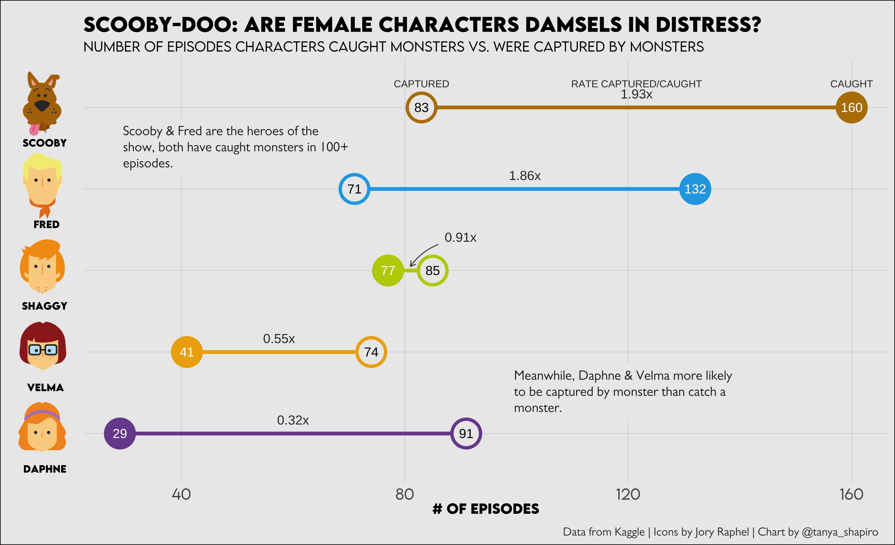
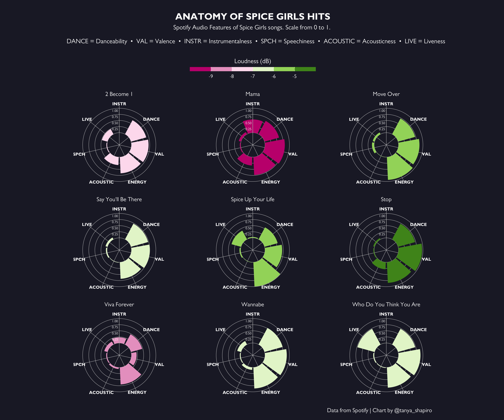

# TidyTuesday 2021

## :memo: &nbsp; Summary
| Week        | Topic           | Visual                                                 | Source   |
|:-----------:|-----------------|--------------------------------------------------------|----------|
| [29](W29)   | Scooby-Doo      | Scooby-Doo: Are Female Characters Damsels in Distress? | Kaggle   |
| [48](W48)   | Doctor Who      | Doctor Who...Was The Best?                             | datardis |
| [49](W49)   | Cricket         | Cricket World Cup 1996                                 | ESPN     |
| [50](W50)   | Spider Taxonomy | A Tangled Web of Spider Taxonomy                       |          |
| [51](W51)   | Spice Girls     | Anatomy of Spice Girls Hits                            | Spotify  |

 
## :bar_chart: &nbsp; Visualizations

### **[W29 - Scooby-Doo: Are Female Characters Damsels in Distress?](W29)**
Analysis of Scooby Doo episodes, visualization represents # of episodes a character caught a monster vs. was captured by a monser. Data from Kaggle. Beautiful character icons from graphic designer, [Jory Raphael](https://dribbble.com/shots/2189161-Scooby-Doo-Icons).

### **[W48 - Doctor Who... Was The Best?](2021/W48)**
Exploring average ratings per episode by Doctor from various Doctor Who seasons. Data visualization inspired by [Cédirc Scherer](https://www.cedricscherer.com/2019/05/17/the-evolution-of-a-ggplot-ep.-1/).

### **[W49 - Cricket World Cup 1996](2021/W49)**
Table graphic summarizing outcomes and scores from World Cricket 1996 (data from ESPN). 

### **[W50 - A Tangled Web of Spider Taxonomy](2021/W50)**
Network graph representing the taxonomy of selected families of spiders within the Aranaea order.

### **[W51 - Anatomy of Spice Girls Hits](2021/W51)**
Radar graphic depicting scaled Spotify Audio features for different Spice Girls hits. Audio features are scaled from 0 to 1.

