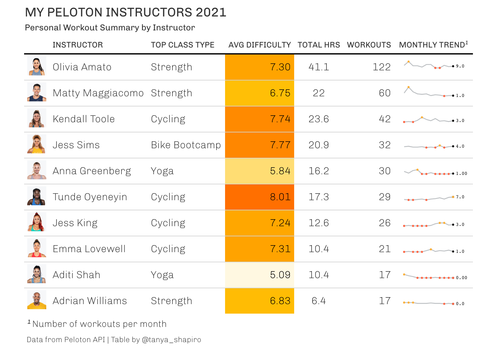
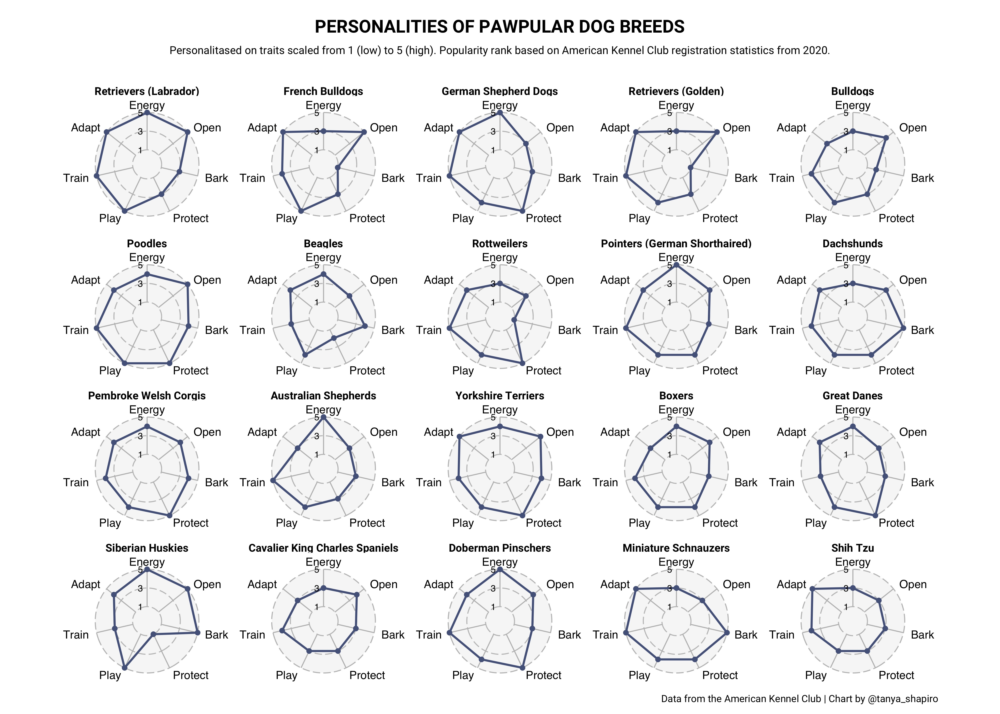
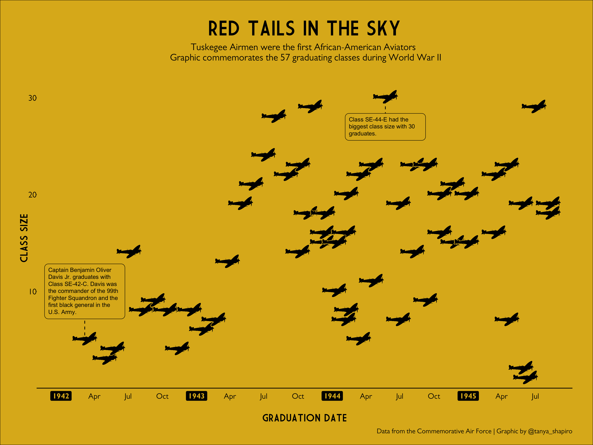
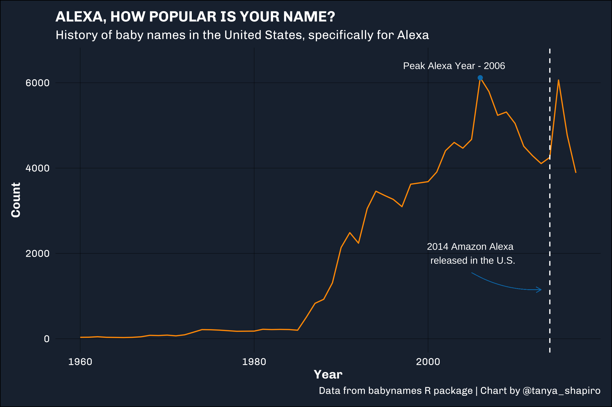

## Summary

|    Week   | Topic                     | Visual                               | Source                 |
|:---------:|---------------------------|--------------------------------------|------------------------|
|  [1](W1)  | Bring Your Own Data       | Peloton Instructor Summary           | Peloton API / pelotonR |
|  [4](W4)  | Board Games               | Popular Board Games (Monopoly Viz)   | Kaggle                 |
|  [5](W5)  | Dog Breeds                | Personalities of Pawpular Dog Breeds | American Kennel Club   |
|  [6](W6)  | Tuskegee Airmen           | Red Tails in The Sky                 | CAF                    |
| [10](W10) | Erasmus Student Mobility  | Erasmus Mobility Chord Diagram       | Data.Europa.eu         |
| [12](W12) | Baby Names                | Alexa, How Popular is Your Name?     | R package babynames    |

## Visualizations

### **[W1 - Peloton Instructor Summary](W1)**
First week of TidyTuesday asked participants to create a visual choosing their own dataset. I used **pelotonR** (wrapper for the Peloton API) to wrangle my own workout data and create a graph using gt tables & **gtExtra**.

### **[W4 - Board Game Favorites](W4)**
Popular board games throughout the ages based on ownership. Data from BoardGameGeek.

### **[W5 - Personalities of Pawpular Dog Breeds](W6)**
Analysis uses **ggradar** to visualize personality traits for most popular dog breeds.

### **[W6 - Red Tails in The Sky](W6)**
Timeline of graduating classes of Tuskegee Airmen (also known as "Red Tails"). Graph created using **ggplot** and **ggimage**.

### **[W10 - Erasmus Student Mobility](W10)**
Student mobility among top participating countries (based on # of students sent and received) between 2014 and 2020.

### **[W12 - Alexa, How Popular is Your Name?](W10)**
Graphic depicting popularity of "Alexa" baby names before and after the release of Amazon's "Alexa."

