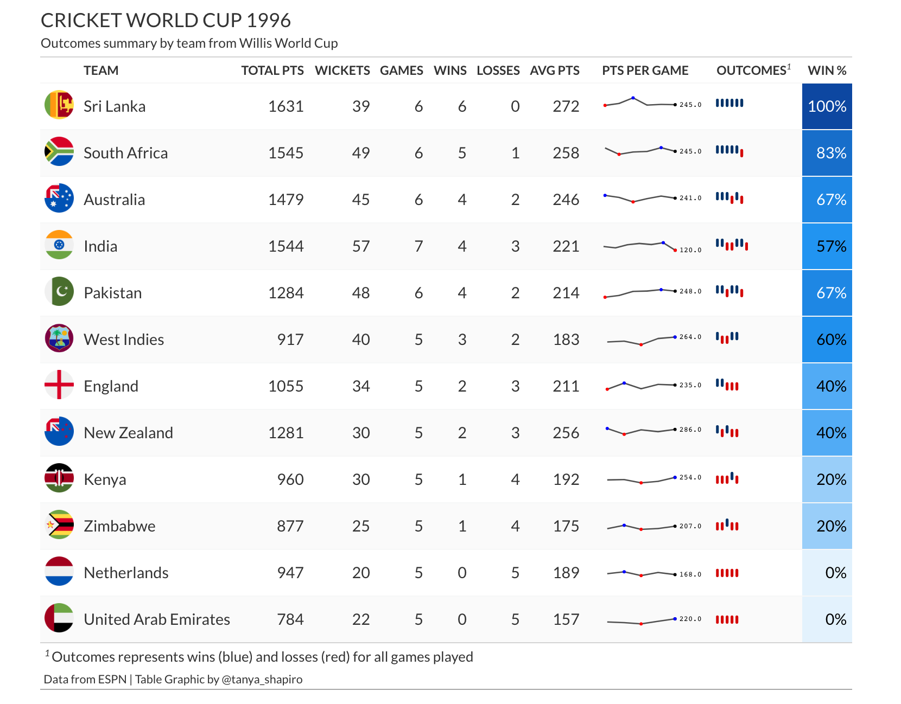
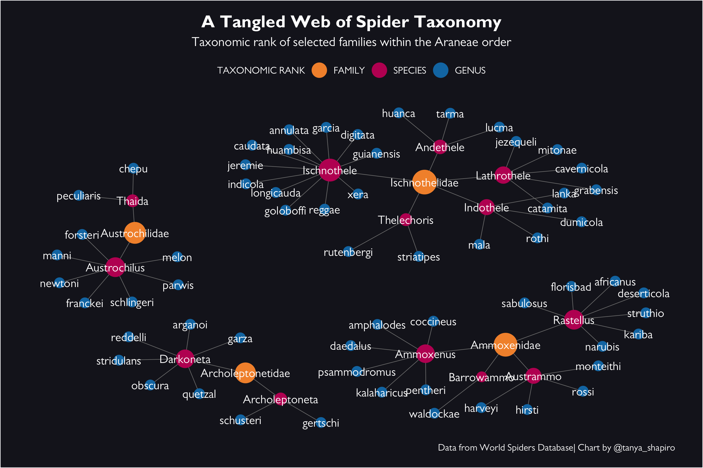

# TidyTuesday

## About

Taken directly from the [R For Data Science](https://github.com/rfordatascience/tidytuesday) TidyTuesday README:

> A weekly data project aimed at the R ecosystem. As this project was borne out of the R4DS Online Learning Community and the R for Data Science textbook, an emphasis was placed on understanding how to summarize and arrange data to make meaningful charts with ggplot2, tidyr, dplyr, and other tools in the tidyverse ecosystem. However, any code-based methodology is welcome - just please remember to share the code used to generate the results.

## Sub-Repositories

I've categorized the code for graphics based on year. You can find code notebooks and more visuals in the sub repositories listed below. Within these folders, you will find code organized by week (e.g. W1, W2, etc).

- [TidyTuesday 2022](2022)
- [TidyTuesday 2021](2021)

## Gallery of Examples

### **[Erasmus Student Mobility (2022W10)](2022/W10)**
Student mobility among top participating countries (based on # of students sent and received) between 2014 and 2020.

### **[Board Game Favorites (2022W4)](2022/W4)**
Popular board games throughout the ages based on ownership. Data from BoardGameGeek.

### **[Doctor Who... Was The Best? (2021W48)](2021/W48)**
Exploring average ratings per episode by Doctor from various Doctor Who seasons. Data visualization inspired by [Cédirc Scherer](https://www.cedricscherer.com/2019/05/17/the-evolution-of-a-ggplot-ep.-1/).

### **[Cricket World Cup 1996 (2021W49)](2021/W49)**
Table graphic summarizing outcomes and scores from World Cricket 1996 (data from ESPN). 

### **[A Tangled Web of Spider Taxonomy (2021W50)](2021/W50)**
Network visualization representing the taxonomc classification of a few different spider families. Data from World Spiders Database.

